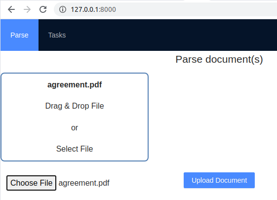

# Text Extraction System GUI

Text Extraction server provides FastAPI interface. FastAPI has a simple Swagger UI that 
the developer can access locally by a URL like `http://127.0.0.1:8000/docs`

The ContraxSuite user can acces the API at `<protocol>://<host>:<port>/text_extraction_system/docs#`.

If this GUI is not enough and the user needs a simple webpage to:
* upload a document
* check the documents' parsing queue
* download processed files

there is a simple GUI:


The developer who runs the text_extraction_system web server:
```
uvicorn text_extraction_system.web_api:app
```
is navigated to this page when browsing to `http://127.0.0.1:8000/`.

# Running the app
text_extraction_system_ui is a Webpack (v 5.18.0) managed ReactJS (v 17.0.1) application written in TypeScript.

Bundling and running the app is a simple process:
1. the developer navigates to `text_extraction_system_ui` folder,
2. runs `npm install` to ensure all node modules in the node_modules folder got updated,
3. and runs `npm run start` to dynamically host the app.

The app relies on text_extraction_system API. In developer configuration the app is hosted as a static bundle
(`http://127.0.0.1:8000/`). In order to get the app running alongsite with API the developer should run the script

```
<repository_root>/text_extraction_system/build_spa.dev.sh
```

# Application design & structure

The application is build from scratch as a Webpack app.
The app is a ReactJS SPA with state managed by MobX.
UI components are either native HTML tags or [AntD](https://ant.design/) classes.

## Files and folders

**src**
Contains top-level components ("pages"), UI components, stores, classes and functions.

**src/app**
Contains the application component files. The application component is the essense of the application: it includes all visual and non-visual elements of the application.

**src/app/App.tsx**
The class `App` is a wrapper around `AppRouter` class. This wrapping is needed to hook up `locationChanged` events.
We use `locationChanged` to detect the fact the user navigated to certain page.

Though the application is SPA it looks like the app has pages. These "pages" are routes supported by `BrowserRouter` component.
Each route renders a page component from `pages` subfolder.

**src/components**
Contains application UI components. Unlike page components UI components ideally contain no state or at least don't communicate with stores.
Each component is imported by referencing the directory name, thus the component code is expected to reside in `/index.tsx`.
The component styles are loaded as a module. For this reason the stylesheet is named `<component name>.module.css`.
Other *.css files are processed according to the following `webpack.config.js` section:

```
{
  test: /((?!\.module).)*crvss$/,
  use: [MiniCssExtractPlugin.loader, 'css-loader'],
},
```

**src/components/FileUpload**
The component allows the user to upload a file either by pressing the button (by using `<input type="button" ... />` control) or by dragging and dropping the file.

**src/components/UploadPresentationalComponent**
This component implements dragging and dropping files. It is only a part of FileUpload component.

**src/entity**
This folder contains "vanilla" TypeScript codes: entities (classes), functions and enumerations.

**src/entity/models**
Presently there are two model classes:

* `UploadRequest` - the information about the original document processing request that is stored into the browser localStorage. The request data includes identifier (`id`) of the request that uses the API. The data also includes the name of the uploaded file and the time request was made.
* `UploadTask` - additionally contains the status of the upload task reported by the server.

**src/pages**
In a SPA a "page" is a (relatively) top-level component that's rendered when the user navigates the corresponding route (see https://reactrouter.com/web/api/BrowserRouter). The page may be "smart" and interact with stores or may delegate its logic to child components.

**src/pages/PageParse.tsx**
The main "page" component where the user uploads a file for processing. The component initiates uploading the file through specific store (`src/store/upload.ts`).

**src/pages/PageTasks.tsx**
The pages displays statuses of the file processing tasks in a table. The tasks are bound to the table component as an observable collection from `src/store/tasks.ts` store.
When the user navigates the page BrowserRouter raises `locationChanged` event that is processed in `src/store/navigationEvents.ts` module. That module function initiates refreshing the task observable collection in `src/store/tasks.ts`.

**src/pages/TopMenu.tsx**
Though "TopMenu" component neither looks nor behaves like a page it's a top level component that is imported directly in `src/app/App.tsx`. TopMenu still renders only its properties and is not bound to any of the stores. That's why TopMenu could be also placed in `src/components`.

**src/store**
This folder contains both conventional MobX stores (with observable collections) and those projiding just actions.
MobX stores are collection of data (@observable and @computed) to be bound to UI components.
Stores also provide actions (@action) to modify the data or to interact with the server.

**src/store/index.ts**
Root storage (`RootStore`) is just an entry point for the components (or stores) to access the specific store. This store aggregation pattern may seem strange but it's the officially proposed way of accessing stores in MobX.

**src/store/navigationEvents.ts**
The store's only action (`processLocationChanged`) initiates extra actions (refreshing tasks) when the BrowserRouter (`src/components/app/App.tsx`) hook is called.

**src/store/notifications.ts**
This store just renders popup notifications in `notifyMessage` action.

**src/store/request.ts**
This store saves file upload requests (id, file name and time) in localStorage. The store also loads the requests from localStorage. The requests are not made @observable because UI components are not supposed to bind to this data. Instead, another store (`tasks.ts`) reads the file upload requests using method `getRequests`.

**src/store/tasks.ts**
This store provides bindable (observable) collection of upload tasks and also observable paging and filtering settings for `src/pages/PageTasks.tsx` component. The store first read the upload requests from `src/store/request.ts`. Then it requests the server for tasks statuses.
NB: `tasks` collection is always sorted and limited by paging settings.

**src/store/upload.ts**
This store's sole purpose is uploading a file to the server and storing the received uploading task id in localStorage (`src/store/request.ts`).

**./**

**.env.default**
... and `.env` - website environment variables. `API_HOST` and `API_PROTOCOL` are the obligatory variables for NodeJS server.

**.eslintrc.json**
The file Code checking rules for es linter. See webpack.config.js
```
{
  test: /\.(js|jsx|ts|tsx)$/,
  exclude: /node_modules/,
  use: ['eslint-loader']
},
```    

**declaration.d.ts**
Presently this file is required for importing `*module.css` files as resorces. See `src/components/UploadPresentationalComponent`.

**typings.d.ts**
Allows referring to *.png files as resources.